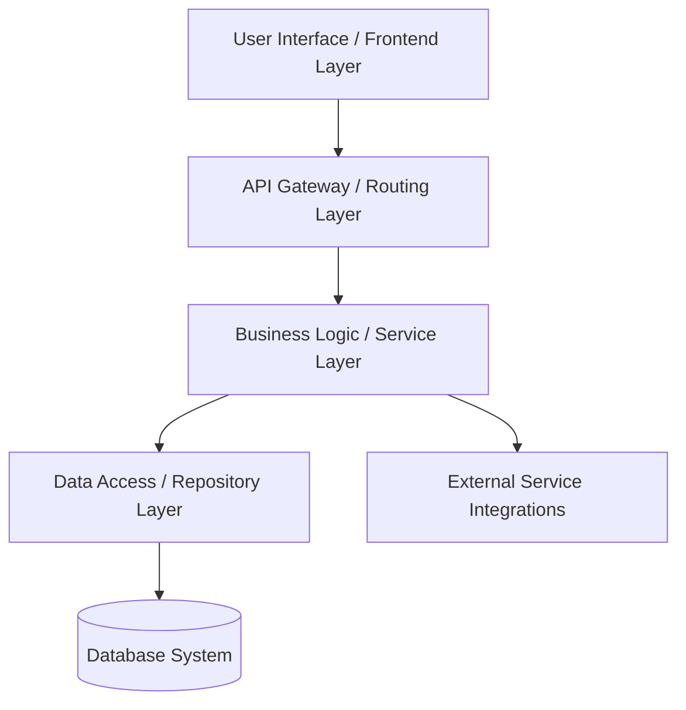

# Arsitektur Sistem & Standar Pengembangan (System Architecture & Development Standards)

Dokumen ini mendefinisikan struktur arsitektur sistem yang universal, mencakup standar terbaik dari sisi **Backend (Database & API)** hingga **Frontend (UI/UX & Performance)**.

---

## 🏗️ 1. Struktur Arsitektur Sistem

Kami menerapkan **Layered Architecture (Arsitektur Berlapis)** dengan pemisahan tanggung jawab yang jelas (*Separation of Concerns*):

### A. Presentation / UI Layer (Frontend)
* Mengurus semua tampilan antarmuka dan interaksi pengguna.
* Wajib menerapkan prinsip **UI/UX 2026** (performa tinggi, aksesibilitas, dan kompleksitas tersembunyi).

### B. Routing & Controller Layer (Backend Gateway)
* Menerima request HTTP/gRPC, memvalidasi parameter input (menggunakan skema validator), dan memetakan data ke Service Layer.
* Tidak boleh mengandung query database langsung atau logika bisnis yang rumit.

### C. Business Logic / Service Layer
* Tempat seluruh aturan bisnis (*business rules*) didefinisikan secara independen.
* Bebas dari ketergantungan langsung ke framework HTTP atau detail database.

### D. Data Access / Repository Layer
* Tempat semua query database (SQL/NoSQL) ditulis.
* Mengisolasi interaksi dengan database agar perubahan skema database tidak merusak logika bisnis di Service Layer.

---

## 🎨 2. Standar UI/UX & Frontend (Era Modern 2026)

Frontend modern berfokus pada **"Invisible Complexity"** (menyembunyikan kompleksitas sistem di balik antarmuka yang intuitif):

### A. Performance is UX (Kecepatan & Responsivitas)
* **Interaction to Next Paint (INP)**: Optimalkan waktu respons interaksi pengguna agar berada di bawah **200ms**.
* **Page Load Speed**: Batasi waktu pemuatan awal halaman maksimal **2.5 detik**. Gunakan teknik lazy loading untuk gambar/komponen berat.
* **State Management**: Gunakan arsitektur penyimpanan status (*state*) terpusat yang efisien tanpa menyebabkan render berlebih (*unnecessary re-renders*).

### B. Invisible Complexity & Cognitive Load
* **Progressive Disclosure**: Jangan menjejalkan semua informasi sekaligus. Tampilkan data secara bertahap sesuai kebutuhan pengguna menggunakan akordion, tab, atau modal interaktif.
* **Smart Defaults**: Sediakan nilai bawaan yang cerdas pada formulir untuk meminimalkan ketikan pengguna.

### C. Accessibility (a11y) & Semantic HTML
* Gunakan elemen HTML5 semantik (seperti `<header>`, `<main>`, `<nav>`, `<article>`, `<button>`).
* Pastikan kontras warna memenuhi standar **WCAG AA** agar mudah dibaca oleh semua kalangan.
* Elemen interaktif harus dapat dinavigasi menggunakan keyboard dan terbaca dengan baik oleh pembaca layar (*screen readers*).

### D. Functional Motion & Micro-interactions
* Gunakan animasi mikro (*micro-interactions*) transisi halus untuk memberikan feedback visual langsung saat tombol ditekan atau data sedang dimuat (misal: *skeleton screen*). Animasi harus fungsional, bukan sekadar dekoratif.

---

## 🗄️ 3. Standar Database & Backend (Data Integrity & Efficiency)

### A. Efisiensi Query & Indexing
* **Indexing**: Buat indeks (*index*) pada kolom yang sering digunakan dalam klausa `WHERE`, `JOIN`, atau `ORDER BY`.
* **Avoid N+1 Query**: Selalu gunakan teknik *eager loading* (seperti `JOIN` atau `Include`) saat mengambil data relasional untuk menghindari beban query berlebih.
* **Pagination**: Gunakan *Cursor-based Pagination* untuk data berukuran besar yang terus mengalir (*infinite scroll*), atau *Offset-based Pagination* untuk data tabel administratif standar.

### B. Integritas & Transaksional Data
* **ACID Compliance**: Gunakan transaksi database (`BEGIN TRANSACTION`, `COMMIT`, `ROLLBACK`) untuk operasi multi-tabel yang harus berhasil seluruhnya atau gagal seluruhnya (misal: transfer saldo, pembuatan invoice).
* **Foreign Keys**: Terapkan relasi kunci asing dengan opsi penanganan yang aman (`ON DELETE RESTRICT` atau `ON DELETE CASCADE` yang terkontrol).

### C. Keamanan Koneksi (Connection Pooling)
* Gunakan *connection pooling* untuk mengelola koneksi database secara efisien guna menghindari kehabisan sumber daya server pada saat beban trafik tinggi.
* Selalu tutup koneksi database setelah selesai digunakan.
